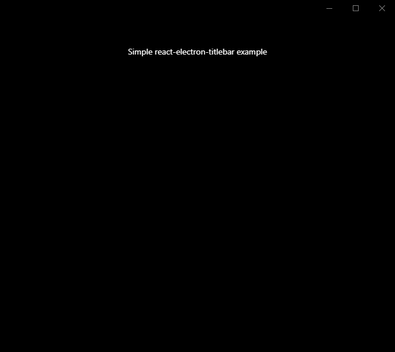

# react-electron-titlebar

React title bar for Electron apps

# Example

**Mac**


**Windows**



# Usage

Install with npm

```bash
npm install react-electron-titlebar
```

Install with yarn

```bash
yarn add react-electron-titlebar
```

# API

Importing the module

```javascript
import Titlebar from 'react-electron-titlebar';

...

<div>
  <Titlebar title="App Title" backgroundColor="#000000">
</div>
```

## Properties

| Property                | Type                  | Default               | Description                                                                                                         |
|-------------------------|-----------------------|-----------------------|---------------------------------------------------------------------------------------------------------------------|
| title | string | null | Title to show for the window
| backgroundColor | string | #000000 | Titlebar background
